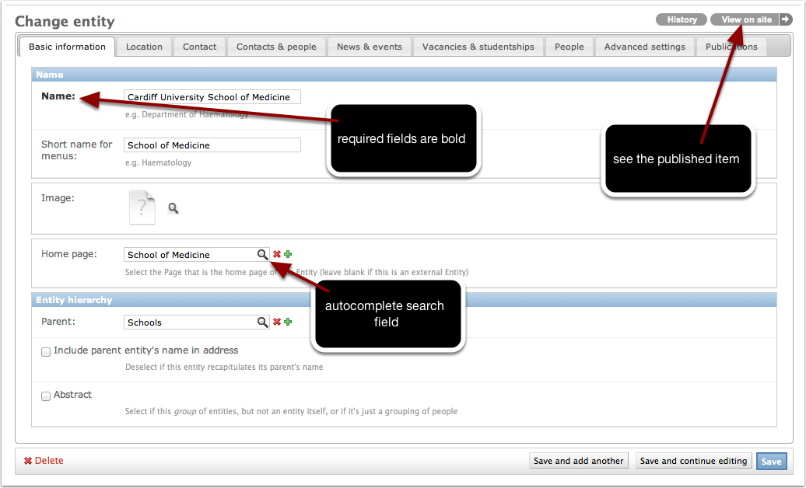

#######################
Entities
#######################  

**************************************************
What exactly is an entity?
**************************************************
An *entity* could be:

an organisation:
	*Cardiff University School of Medicine*
a part of a larger organisation:
	*Institute of Infection & Immunity*
	*Research Office*
a group of other entities:
	*Research institutes*

	*Administrative & support offices*
a collection of people:
	*Web editors*
	*School IT liaison officers*
	
Entities exist in a *hierarchy*:

*	Cardiff University

	*	Cardiff University School of Medicine

		*	Institutes

			*	Institute of Infection & Immunity	 
			*	Institute of Cancer Genetics
			*	Institute of Medical Education

				*	Admissions
				*	Assessments
		*	Administrative offices

			*	Finance
			*	Personnel

**************************************************
Managing entities
**************************************************

Let's start by getting to work on an entity.

The Entities change list
************************

In the Arkestra admin site, find `Contacts & people` > `Entities`. They are arranged in a tree reflecting the hierarchy of entities.

.. figure:: entity-change-list.png 
   :width: 100%
   :alt: map to buried treasure

   The **Entities** change list

You can:

* **search** the list of Entities
* **filter** the list according to various criteria
* **expand and collapse** sections of the hiearchy using the controls in the window
* **move** entites by dragging them around within the tree

Either select an existing entity to edit, or create a new one if none exist.    

Editing an entity
*****************

   The **Entity** change view - you'll find many of the same controls and
   features throughout Arkestra's adminstration interface.

This is where we tell Arkestra what it needs to know about our entity.

Basic information
=================

Name   
	its official title, in full

Short name for menus
	a shorter version, if required

Image 
	an image (for example a logo)

Home page
	The entity will likely have a number of pages associated with it in the
	**Pages** system that; select the root page of that section. Arkestra will
	know that *all* the pages in that section belong to this entity.

Parent
	The entity's parent in the hierarchy. You can also change this by dragging the entity around in the change list, but if the hierarchy contains hundreds of items, this is a more efficient way to do it.
	
Include parent entity's name in address
	Arkestra builds an entity's address automatically, and will include its parent's name in that automatically. Usually that makes sense (*IT Office, School of Medicine*, but sometimes it might look silly (*Cardiff University School of Medicine, Cardiff University*), so this allows us to turn it off.
	
Abstract
	Some entities are actual organisational entities, like the University or the Research Office. Others are just useful groupings, or *abstract entities*.   
	
Location
========

Address
	This is there to show you how Arkestra will render the entity's address       
	
Building
	where the entity is based
	
Building recapitulates entity name
	Sometimes, the building name and the entity name are so similar it would be silly to have them both in the address. If so, this field allows Arkestra to know that it shouldn't include them both in addresses
	
Precise location
	the place *inside* the building - floor, room number, etc
	
Precise location
	any note for potential visitors 
	
Contact
========     

Email address
	if the entity has its own email address

Phone contacts
	choose or add a suitable label; don't try to format numbers
	
Contacts & people, News & Events, Vacancies & Studentships
==========================================================

Arkestra will publish pages of various types automatically if required. The controls are very similar for them all, and also for other modules that might be added by other applications, and will look much like:

Publish a contacts and people page for this entity automatically 
   if this entity should have its own contacts and people page

Title
	what the page should be called
	
